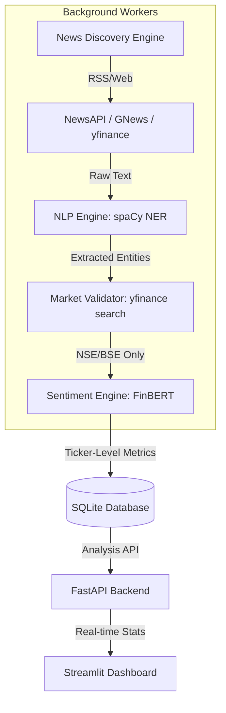

# 📉 AI Stock News Sentiment Analysis System (NSE/BSE)

[](https://fastapi.tiangolo.com/)
[](https://streamlit.io/)
[](https://huggingface.co/yiyanghkust/finbert-tone)
[](https://github.com/psf/black)
[](https://github.com/astral-sh/ruff)
[](https://www.python.org/)

An advanced, autonomous AI-powered sentiment analysis system specifically engineered for the **Indian Stock Market (NSE/BSE)**. This system automatically discovers trending financial news, detects listed companies using Named Entity Recognition (NER), and performs context-aware sentiment analysis using state-of-the-art transformer models.

Explore the live market pulse with a high-performance, developer-friendly architecture.

---

## 🏗️ Architecture Design

The system follows a decoupled, event-driven architecture designed for high availability and low latency.



---

## 🔥 Key Features

-   **🤖 Autonomous Discovery**: Scans live RSS feeds from Top Indian financial outlets (*MoneyControl, Economic Times, LiveMint*) to detect emerging market trends.
-   **🏢 Intelligent Entity Extraction**: Built with **spaCy NER** to automatically identify company names in raw news text.
-   **🛡️ Strict Market Filtering**: Automatically validates detected companies against NSE/BSE tickers. Only companies with a `.NS` or `.BO` suffix are processed.
-   **💎 Financial-Grade Sentiment**: Leverages **FinBERT** (`yiyanghkust/finbert-tone`) for analysis that understands financial nuances.
-   **📊 Premium Dashboard**: A high-contrast, professional Streamlit interface with sentiment trends and news cards.
-   **⚡ Background Tasking**: Heavy scraping and analysis tasks run in background threads (FastAPI `BackgroundTasks`) to keep the UI snappy.

---

## 🛠️ Technology Stack

| Component | Technology |
| :--- | :--- |
| **Backend** | FastAPI, SQLAlchemy |
| **Frontend** | Streamlit, Plotly |
| **NLP** | spaCy (NER), FinBERT (Sentiment) |
| **Scraping** | BeautifulSoup4, Feedparser, yfinance |
| **Tooling** | Black (Formatting), Ruff (Linting) |
| **Database** | SQLite |

---

## 🚦 Getting Started

### 1️⃣ Clone the Repository
```bash
git clone https://github.com/krish1440/AI-Stock-News-Sentiment.git
cd AI-Stock-News-Sentiment
```

### 2️⃣ Environment Configuration
Create a `.env` file in the root directory. You can use the provided `.env.example` as a template:

```bash
cp .env.example .env
```

**Required Keys:**
- `NEWS_API_KEY`: Get yours at [newsapi.org](https://newsapi.org/)
- `HF_TOKEN`: Get yours at [huggingface.co](https://huggingface.co/settings/tokens)

**Example `.env`:**
```env
NEWS_API_KEY=5678...
HF_TOKEN=hf_...
```

### 3️⃣ Install Dependencies
```bash
pip install -r requirements.txt
python -m spacy download en_core_web_sm
```

### 4️⃣ Launch the System
**Start the Backend API:**
```bash
uvicorn backend.main:app --reload
```

**Start the Dashboard:**
```bash
streamlit run frontend/dashboard.py
```

---

## 💎 Developer Experience

We maintain high code quality standards using modern Python tooling.

**Development Setup:**
```bash
pip install -r requirements-dev.txt
```

**Quality Checks:**
- **Formatting**: `black backend/ frontend/`
- **Linting**: `ruff check backend/ frontend/`
- **Typing**: `mypy backend/`

---

## 🚀 Future Roadmap

- [ ] **🤖 Portfolio Agent**: Integrate LLMs (Gemma/Llama) to provide reasoning for specific sentiment spikes.
- [ ] **🔔 Real-time Alerts**: Telegram/Slack webhooks for immediate notification of highly positive/negative news.
- [ ] **📈 Advanced Metrics**: Correlate news sentiment with actual stock price movements (LTP/Volume).
- [ ] **🌐 Global Support**: Extend market validation to NASDAQ/NYSE and other major exchanges.

---

## 🤝 Contributing
Contributions are welcome! Please feel free to submit a Pull Request.

## 📄 License
This project is licensed under the MIT License.
